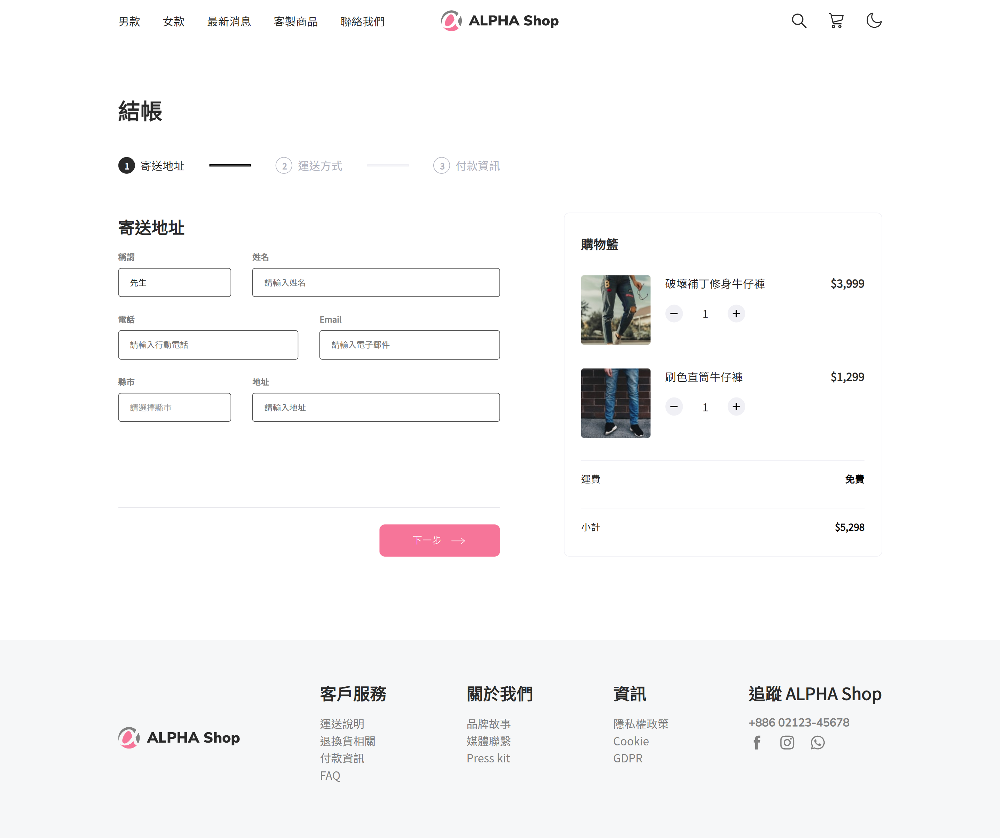
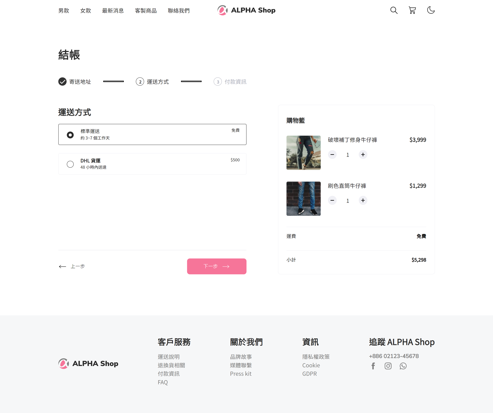
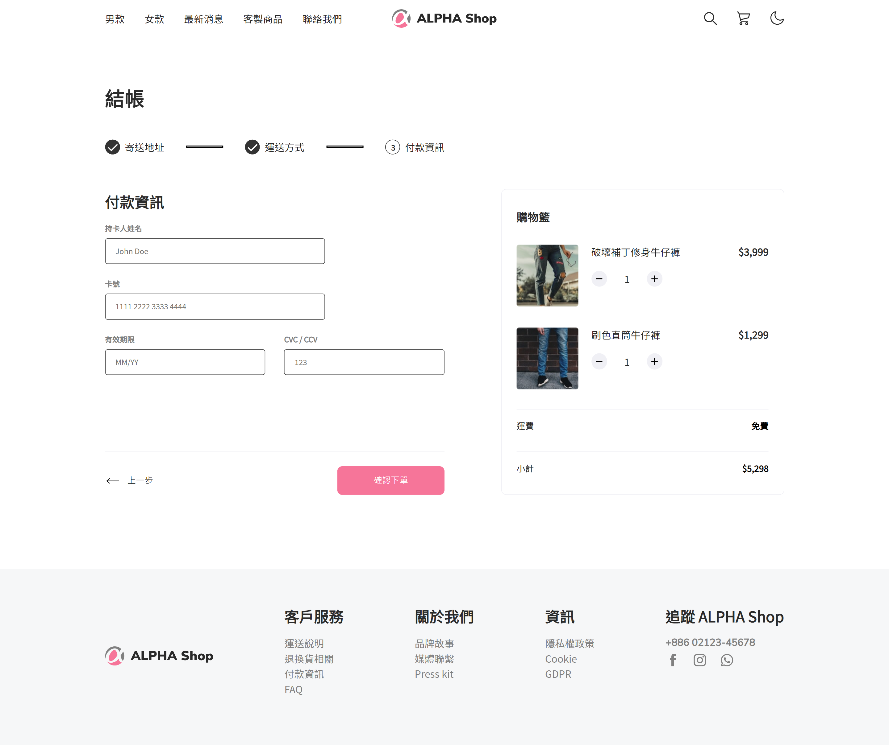
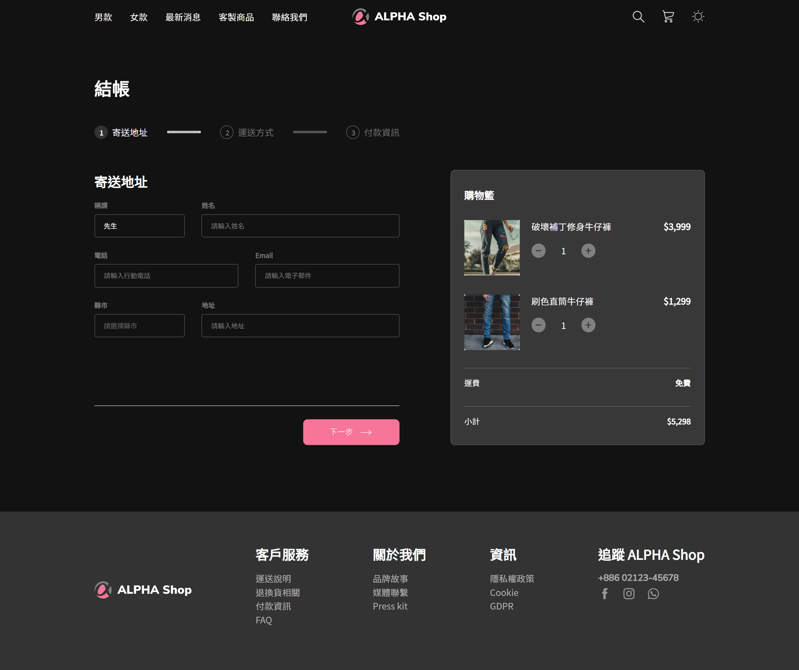
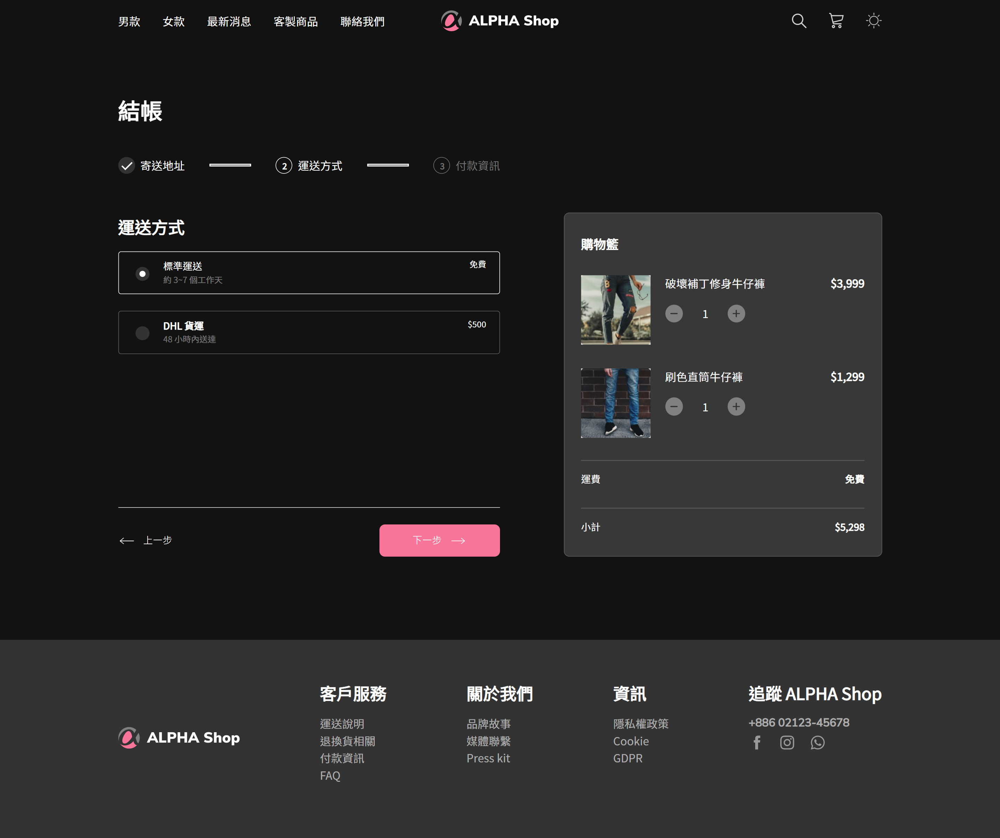
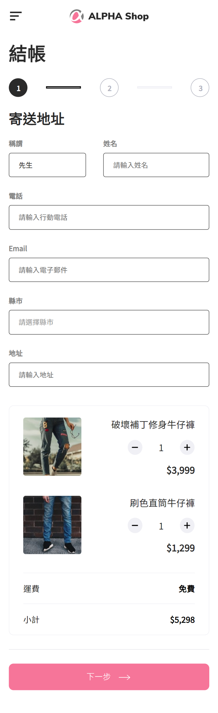
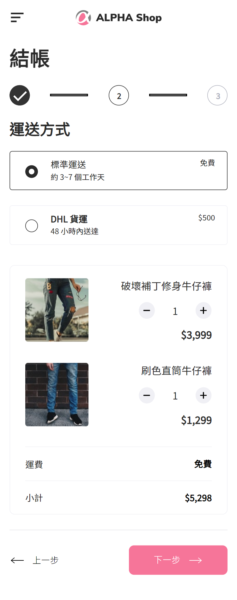
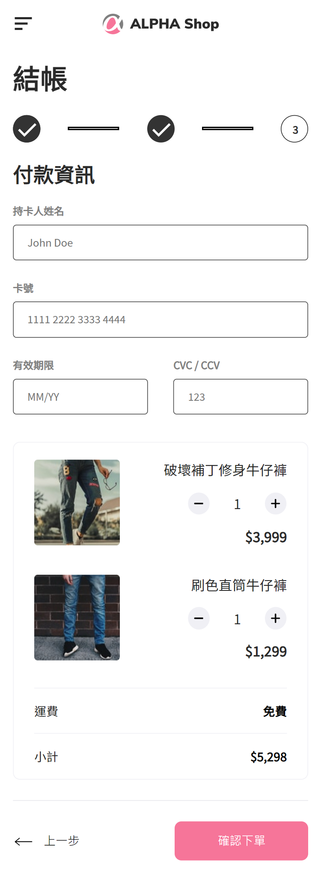
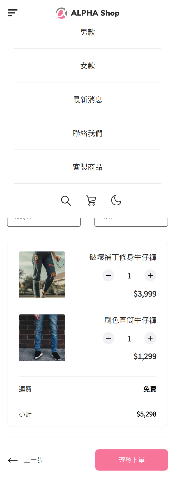

# ALPHA Shop
ALPHA CAMP Season 3 Frontend Assignment 1
- - -
## Project Preview

- - -

## This project is currently built on
* [JavaScript](https://developer.mozilla.org/en-US/docs/Web/JavaScript)
* [Webpack](https://webpack.js.org/)
* [SASS/SCSS](https://sass-lang.com/)
- - -

## Features of the project
* It supports desktop and mobile layout (display currently switchs on 749.9px)
* It supports theme switch (currently only light and dark theme available)

- - -

## Project Usage Guide
Install dependency

`npm install`

Let Webpack watch the directories and automatically compiles files when file changed

`npm run watch`

Build production ready files for distribution

`npm run build`

- - -

## Project Directory Explanation
    /src         - root directory of source code
    /src/style   - CSS style
    /public      - root directory of static files
    /public/icons - SVG icons
    /public/images - pictures
    /dist        - output directory for compiled files

